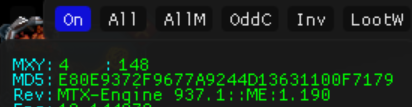

import React from 'react';
import ContentBlock from '@site/src/components/ContentBlock';
import BrowserWindow from '@site/src/components/BrowserWindow';
import Tabs from '@theme/Tabs';
import TabItem from '@theme/TabItem';

:::hidden
## Acquiring
:::

<ContentBlock title="Acquiring">
Get the latest release build from the MemoryError discord <u>[**tool-release**](https://discord.com/channels/809828167015596053/1094154063702147122)</u> channel.
</ContentBlock>

:::hidden
## Setup
:::

<ContentBlock title="Setup">
<BrowserWindow url="https://discord.com/channels/809828167015596053/1094154063702147122">

:::hidden
## Extraction
:::

    - Extract the archive.
    - Copy the `Lua_Scripts` folder to `%userprofile%\Documents\MemoryError\Lua_Scripts`.

        > 

---

:::hidden
## DLL Injection Modes
:::

<Tabs>
  <TabItem value="a" label="Auto Inject">
  
      If you want to auto-inject ME when you launch the game follow these steps:
        - Download the Take Ownership hack from [here](https://www.tenforums.com/tutorials/3841-add-take-ownership-context-menu-windows-10-a.html)
        - Go to `C:\Windows\System32` and Take Ownership of `XInput1_4.dll`. Backup the dll someplace else and delete if from `C:\Windows\System32`

            > 
        - copy the `XInput1_4.dll` from the extracted archive into `System32` directory
        - Launch the game
  </TabItem>

  <TabItem value="b" label="Manual Injection">

    - Start/already have RuneScape running.
    - Inject `XInput1_4_inject.dll` from the extracted archive using the injector of your choice
    - Wait for the dll to be injected. (you should see a debug bar at top left of your screen when it's injected)
  </TabItem>
</Tabs>

---

- You should see a debug bar at top left of your screen when ME is injected successfully

    > 

</BrowserWindow>
</ContentBlock>

:::hidden
## FAQ
:::

<ContentBlock title="FAQs">
- #### ME isn't running? What am I doing wrong?
    > - Make sure that you aren't running Runescape under compatibility mode.
    >
    > - Windows might have quarantined your dll.
---
- #### Why is the script throwing errors? Something about api missing?
    > - Make sure you are running the latest version of `MemoryError`. You can verify this by looking in the Debug Menu by following these steps:
    >   - Click on the `>` button in the top left of your game window
    >   - Click on the `Off` button in the Debug Menu
    >   - You should see a line saying `Rev: MTX-Engine XXX.X` followed by the version of **ME**
    >
    >       
    >
    > - Make sure that you have the latest `api.lua` file in your `Lua_Scripts` folder located at `%userprofile%\Documents\MemoryError\Lua_Scripts`.
    >
    > - If you are using any utility files, make sure they are also in your `Lua_Scripts` folder.
---
- #### Where can I find scripts to run?

    > - You can find the scripts and libraries I've authored right here on this website.
    >   - <u>[**Scripts**](/category/scripts)</u>
    >   - <u>[**Libraries**](/category/libraries)</u>
---
    > - You can find published scripts on the <u>[**learning-index**](https://discord.com/channels/809828167015596053/1205703390706016266)</u> channel on the MemoryError discord.

Warning about Discord Scripts

:::danger Discord Scripts
**The published scripts on `Discord` are neither curated nor moderated**.

**Always read through and verify every script before you run it for your own safety**.
:::

---
- #### How do I know what arguments to pass to functions?
    > - You can refer to `api.lua` and `usertypes.lua` to find the structs that the `sol2` bindings support.
---
</ContentBlock>