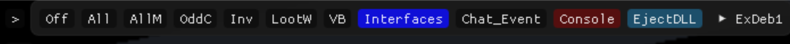

import React from 'react';
import ContentBlock from '@site/src/components/ContentBlock';
import BrowserWindow from '@site/src/components/BrowserWindow';

:::hidden
## Opening Interface Debugger
:::

<ContentBlock title="Opening Interface Debugger">

You can open the interface debugger by performing the following actions on the debug menu
- Click `>`
- Click `Interfaces`
<BrowserWindow url="Opening interface debug">

 </BrowserWindow>
</ContentBlock>

:::hidden
## Interface Options
:::

<ContentBlock title="Interface Options">
This will now open up the interfaces window
<BrowserWindow url="Interface Options">
 
  </BrowserWindow>
</ContentBlock>

:::hidden
## Finding Interfaces
:::

<ContentBlock title="Finding Interfaces">

The simplest way to find interfaces, is using the `FilterText` option.

<BrowserWindow url="Finding Interfaces by visible text">
 
 </BrowserWindow>

 The console out for the above action is below:
 ```lua
 Current: 1477:704:14:704 Index: 4
Full path:  : 17fcdef9450 : 17fcddfe650 : 17fcddfa050 : 17fcddfe850 : 17fc69f8e10
Current IDs: 1477:704:14:704
Full IDs: { { 1477,25,-1,-1,0 }, { 1477,699,-1,25,0 }, { 1477,700,-1,699,0 }, { 1477,704,-1,700,0 }, { 1477,704,14,704,0 } }
 ```
</ContentBlock>

:::hidden
## Using Interface Values
:::


<ContentBlock title="Using Interface Values">
Now that we have an interface ID, let's see how to use the values in your scripts.

```lua showLineNumbers
--[[
    We have to create a table of InterfaceComp5
    for every single element in the full path 

    {
        { 1477,25,-1,-1,0 },
        { 1477,699,-1,25,0 },
        { 1477,700,-1,699,0 },
        { 1477,704,-1,700,0 },
        { 1477,704,14,704,0 }
    }
]]

local customisationInterface = {
    InterfaceComp5.new(1477,25,-1,-1,0),
    InterfaceComp5.new(1477,699,-1,25,0),
    InterfaceComp5.new(1477,700,-1,699,0),
    InterfaceComp5.new(1477,704,-1,700,0),
    InterfaceComp5.new(1477,704,14,704,0),
}

--[[
    We will then call API.ScanForInterfaceTest2Get
    with the table we created.
    The first argument is a boolean which says
    if we have to scan the child interfaces or not.

    In this function, we're checking if we find any interfaces
    with the hierarchy that we requested for and
    returning true if we did.
]]
local function isCustomisationInterfacePresent()
    local result = API.ScanForInterfaceTest2Get(true, customisationInterface)
    if #result > 0 then
        return true
    else return false end
end

```
</ContentBlock>