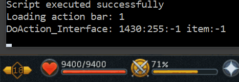

import React from 'react';
import TopBanner from '@site/src/components/TopBanner';
import ContentBlock from '@site/src/components/ContentBlock';
import Changelog from '@site/src/components/Changelog';
import BrowserWindow from '@site/src/components/BrowserWindow';
import changes from './changes.json'

<TopBanner title="Dead Utils" version="2024.01">
</TopBanner>

:::hidden
## Usage
:::

<ContentBlock title="Usage">

```lua
local UTILS = require("utils")
UTILS:antiIdle()
```

</ContentBlock>

:::hidden
## Changelog
:::

<Changelog changes={changes}>

</Changelog>


:::hidden
## Functions
:::

<ContentBlock title="Functions">
---
### `antiIdle`
> The anti idle function we've all been using
---
### `isEmpty`
> Parameters
> - s `string`

> Function to tell if a string is empty
---
### `randomSleep`
> Parameters
> - milliseconds `number`

> Sleeps to a random duration
---
### `gameStateChecks`
> Checks for the following
> - If we're logged in
> - If script is looping
---
### `CanUseLodestone`
> Checks if we can use a lodestone
> After exiting combat, you can use a lodestone for a specific duration.
> 
> This method tells you when you can use a lodestone
---
### `waitForPlayerAtCoords`
> Parameters
> - coords `WPOINT`
> - threshold `number`
> - maxWaitInSeconds `number`

> Wait for a player to reach a coords within a threshold, upto defined seconds
---
### `concatenateTables`
> Parameters
> - comma seperated list of tables to concatenate

> Returns a new table combining all the input tables

```lua title="Example" showLineNumbers
local ITEMS = {}

ITEMS.COMMON = {
    995 -- gold coins
}

ITEMS.RUNES = {
    554, -- fire
    555, -- water
    556, -- air
    557 -- earth
}
--highlight-next-line
local lootableItems = UTILS.concatenateTables(ITEMS.COMMON, ITEMS.RUNES)

```
---
### `getDistinctValues`
> Parameters
> - inputTable `table`

> Returns a table with unique values
---
### `getDistinctByProperty`
> Parameters
> - inputTable `table`
> - property `string`

> Returns a table with unique elements based on the provided property
---
### `DO_RandomEvents`
> Handles the following random events
> - 18204 `Chronicle fragment`, 18205 `other peoples`
> - 19884 `Guthix butterfly`
> - 26022 `Seren spirit`
> - 27228 `Divine blessing`
> - 27297 `Forge phoenix`
> - 28411 `Catalyst`
> - 30599 `Halloween Pumpkin`
> - 15451 `Fire spirit`
---

### `LoadActionBar`
> Parameters
> - barNumber `number`

> Loads the primary action bar
>
> 
---

### `getSkillOnBar`
> Parameters
> - skillName `string`
> Get's a skill on the ability bar
>
> Checks if it can be used
>
> Returns nil if the skill isn't found or can't be used
---

### `countTicks`
> Parameters
> - ticks `number`

> Sleeps for the given number of game ticks
---

### `rangeSleep`
> Parameters
> - milliseconds `number`
> - randMin `number` = 0
> - randMax `number` = 0

> Sleeps for random number of milliseconds
---
### `SleepUntil`
> Parameters
> - conditionFunc `function`
> - timeout `number` (seconds)
> - message `string`
> - ... any `arguments to the function`
> - @return `boolean`

> Sleeps until the passed condition returns true or the timeout duration is reached
>
> **Checks for random events, game state and API.Read_LoopyLoop while sleeping**

```lua title="Example" showLineNumbers

function UTILS.isChooseOptionInterfaceOpen()
    return API.Compare2874Status(12, false)
end
--highlight-start
local function waitForChooseOption()
    return UTILS.SleepUntil(UTILS.isChooseOptionInterfaceOpen, 20, "Waiting for choose option to open")
end
--highlight-end
local wasItOpen = waitForChooseOption()
```
---

### `SleepUtilWithoutChecks`
> Parameters
> - conditionFunc `function`
> - timeout `number` (seconds)
> - message `string`
> - ... any `arguments to the function`
> - @return `boolean`

> Sleeps until the passed condition returns true or the timeout duration is reached
>
> **There are no checks in place**
---

### `getAmountInOrebox`
> Parameters
> - oreId `number`

> Returns the number of ores of requested id present in ore box.
>
> **`UTILS.ORES.NECRITE`** can be used in place of the ID for Necrite (44826)

---
</ContentBlock>

:::hidden
## Code
:::

<ContentBlock title="Code">

```lua showLineNumbers
--[[
#Script Name:   <utils.lua>
# Description:  <Collection of utility functions>
# Autor:        <Dead (dea.d - Discord)>
# Version:      <2.0>
# Datum:        <2024.01.31>
--]]

local API = require("api")
local UTILS = {}

UTILS.__index = UTILS

function UTILS.new()
    local self = setmetatable({}, UTILS)
    self.afk = os.time()
    self.randomTime = math.random(180, 280)
    self.worldTime = os.time()
    return self
end

local MAX_IDLE_TIME_MINUTES = 5

UTILS.ORES = {
    COPPER = 436,
    TIN = 438,
    IRON = 440,
    SILVER = 442,
    GOLD = 444,
    MITHRIL = 447,
    ADAMANTITE = 449,
    RUNITE = 451,
    COAL = 453,
    BANITE = 21778,
    LUMINITE = 44820,
    ORICHALCITE = 44822,
    DRAKOLITH = 44824,
    NECRITE = 44826,
    PHASMATITE = 44828,
    LIGHT_ANIMICA = 44830,
    DARK_ANIMICA = 44832
}

--- The anti idle function we've all been using
---@return boolean
function UTILS:antiIdle()
    local timeDiff = os.difftime(os.time(), self.afk)
    local randomTime = math.random((MAX_IDLE_TIME_MINUTES * 60) * 0.6, (MAX_IDLE_TIME_MINUTES * 60) * 0.9)
    if timeDiff > randomTime then
        API.PIdle2()
        self.afk = os.time()
        return true
    end
end

--- Function to tell if a string is empty
function UTILS.isEmpty(s)
    return s == nil or s == ''
end

--- Function to convert userdata to vector<string>
function UTILS.UserDataToVector(userdata)
    local vector = {}

    -- Iterate over the userdata values and extract them
    for i = 1, #userdata do
        vector[i] = userdata[i]
    end

    return vector
end

--- Function to sleep for milliseconds with a random delay
---@param milliseconds number
function UTILS.randomSleep(milliseconds)
    local randomDelay = math.random(1, 200)
    local totalDelay = milliseconds + randomDelay
    local start = os.clock()
    local target = start + (totalDelay / 1000)
    while os.clock() < target do
        API.RandomSleep2(100, 0, 0)
    end
end

--- Function to convert userdata to string
function UTILS.UserDataToString(userdata)
    local vector = {}

    -- Iterate over the userdata values and extract them
    for i = 1, #userdata do
        vector[i] = userdata[i]
    end

    return table.concat(vector, "")
end

--- Function to convert a Lua table to string
---comment
---@param tbl table
---@return string
function UTILS.tableToString(tbl)
    local strTable = {}
    for _, innerTbl in ipairs(tbl) do
        local strInnerTable = {}
        for _, value in ipairs(innerTbl) do
            table.insert(strInnerTable, tostring(value))
        end
        table.insert(strTable, "{" .. table.concat(strInnerTable, ", ") .. "}")
    end
    return table.concat(strTable, ", ")
end

--- Function to check for various game states<br>
--- Checks if we're logged in and if API.Read_LoopyLoop() is true
---@return boolean
function UTILS.gameStateChecks()
    if not API.PlayerLoggedIn() then
        print('not logged in')
        API.Write_LoopyLoop(false)
        return false
    end
    if not API.Read_LoopyLoop() then
        print('LoopyLoop is false')
        return false
    end
    return true
end

--- Function to wait for an animation to complete, upto defined seconds
---@param animationId number
---@param maxWaitInSeconds number
---@return boolean
function UTILS.waitForAnimation(animationId, maxWaitInSeconds)
    local animation = animationId or 0
    local waitTime = maxWaitInSeconds or 5
    local exitLoop = false
    local start = os.time()
    while not exitLoop and os.time() - start < waitTime do
        if not (API.Read_LoopyLoop() or API.PlayerLoggedIn()) then
            exitLoop = true
            return false
        end
        if (API.ReadPlayerAnim() == animation) then
            exitLoop = true
            return true
        end
        UTILS.rangeSleep(50, 50, 50)
    end
end

--- After exiting combat, you can use a lodestone for a specific duration.<br>
--- This method tells you when you can use a lodestone
---@return boolean
function UTILS.CanUseLodestone()
    local vb = API.VB_FindPSett(7994)
    return vb.state == -1 or vb.stateAlt == -1
end

--- Function to wait for a player to reach a coords within a threshold, upto defined seconds
---comment
---@param coords WPOINT
---@param threshold number
---@param maxWaitInSeconds number
---@return boolean
function UTILS.waitForPlayerAtCoords(coords, threshold, maxWaitInSeconds)
    local waitTime = maxWaitInSeconds or 5
    local variance = threshold or 0
    local exitLoop = false
    local start = os.time()
    while not exitLoop and os.time() - start < waitTime do
        if not (API.Read_LoopyLoop() or API.PlayerLoggedIn()) then
            exitLoop = true
            return false
        end
        if (API.PInAreaW(coords, variance)) then
            exitLoop = true
            return true
        end
        UTILS.rangeSleep(50, 50, 50)
    end
    return false
end

--- Function to get the label of the table element
---comment
---@param arg any
---@param table table
---@return any | nil
function UTILS.GetLabelFromArgument(arg, table)
    for label, record in pairs(table) do
        if record == arg then
            return label
        end
    end
    return nil
end

--- Function to concatenate tables
---@param ... table[]
---@return table
function UTILS.concatenateTables(...)
    local result = {}
    for _, tbl in ipairs({ ... }) do
        for _, value in ipairs(tbl) do
            table.insert(result, value)
        end
    end
    return result
end

--- Function to extract distinct values from a table
---@param inputTable table
---@return table
function UTILS.getDistinctValues(inputTable)
    local distinctValues = {}
    local seenValues = {}

    for _, value in ipairs(inputTable) do
        if not seenValues[value] then
            table.insert(distinctValues, value)
            seenValues[value] = true
        end
    end
    return distinctValues
end

--- Function to get you distinct values from the input table based on the property
---comment
---@param inputTable table
---@param property string
---@return table
function UTILS.getDistinctByProperty(inputTable, property)
    local distinctValues = {}
    local seenValues = {}

    for _, value in ipairs(inputTable) do
        local prop = value[property]
        if not seenValues[prop] then
            table.insert(distinctValues, value)
            seenValues[prop] = true
        end
    end
    return distinctValues
end

--[[
Handles the below random events
<br>18204 Chronicle fragment, other peopls 18205
<br>19884 Guthix butterfly       	
<br>26022 Seren spirit
<br>27228 Divine blessing
<br>27297 Forge phoenix
<br>28411 Catalyst
<br>30599 Halloween Pumpkin
<br>15451 Fire spirit
]]
---@return boolean
function UTILS.DO_RandomEvents()
    local F_obj = API.GetAllObjArrayInteract({ 19884, 26022, 27228, 27297, 28411, 30599, 15451 }, 20, 1)
    --if not (F_obj) == nil then
    if (F_Obj) ~= nil then
        print("Random event object detected: trying to click")
        UTILS.randomSleep(1000)
        if API.DoAction_NPC__Direct(0x29, API.InteractNPC_route, F_obj[1]) then
            UTILS.randomSleep(1000)
            return true
        end
    end
    return false
end

--- Function to load a primary action bar
---@param barNumber number
---@return boolean
function UTILS.LoadActionBar(barNumber)
    print("Loading action bar: " .. barNumber)

    local selected = { id = nil, number = nil, offset = nil }

    -- Set [5th param in DO::DoAction_Interface]
    if barNumber >= 1 and barNumber <= 10 then
        selected.number = 255
    elseif barNumber >= 11 and barNumber <= 15 then
        selected.number = 254
    elseif barNumber >= 16 and barNumber <= 18 then
        selected.number = 253
    else
        print("Invalid bar number passed: " .. tostring(barNumber))
        return false
    end

    -- Set Offset [7th param in DO::DoAction_Interface]
    if barNumber >= 1 and barNumber <= 5 then
        selected.offset = API.OFF_ACT_GeneralInterface_route
    elseif barNumber >= 6 and barNumber <= 18 then
        selected.offset = API.OFF_ACT_GeneralInterface_route2
    end
    -- set number [3rd param in DO::DoAction_Interface]
    if barNumber == 10 or barNumber == 15 then
        selected.id = 10
    elseif barNumber >= 1 and barNumber <= 9 then
        selected.id = barNumber
    elseif barNumber >= 11 and barNumber <= 14 then
        selected.id = barNumber - 5
    elseif barNumber >= 16 and barNumber <= 18 then
        selected.id = barNumber - 10
    end

    -- print("selected is: {id: " .. selected.id .. ", number: " .. selected.number .. ", offset: " .. selected.offset)
    API.DoAction_Interface(0xffffffff, 0xffffffff, selected.id, 1430, selected.number, -1, selected.offset)
end

--- Get's a skill on the ability bar<br>
--- Checks if it can be used<br>
--- Returns nil if the skill isn't found or can't be used
---@param skillName string
---@return Abilitybar | nil
function UTILS.getSkillOnBar(skillName)
    local skillOnAB = API.GetABs_name1(skillName)
    if skillOnAB.id ~= 0 and skillOnAB.enabled then
        return skillOnAB
    else
        return nil
    end
end

--- Waits for a number of ticks
---@param ticks number
---@return boolean
function UTILS.countTicks(ticks)
    local ticker = 0
    API.Check_tick()
    while ticker < ticks do
        UTILS.rangeSleep(10, 10, 10)
        if API.Check_tick() then
            ticker = ticker + 1
        end
        if not UTILS.gameStateChecks() then
            return false
        end
    end
    return true
end

-- Function to sleep for milliseconds with a random delay
---comment
---@param milliseconds number
---@param randMin number = 0
---@param randMax number = 0
function UTILS.rangeSleep(milliseconds, randMin, randMax)
    randMin = randMin or 0
    randMax = randMax or 0
    local randomDelay = math.random(randMin, randMax)
    local totalDelay = milliseconds + randomDelay
    local start = os.clock()
    local target = start + (totalDelay / 1000)
    while os.clock() < target do
        API.RandomSleep2(50,0,0)
    end
end

--- Sleeps until the condition function returns true<br>
--- Checks for other random events,game state and API.Read_LoopyLoop
---@param conditionFunc function
---@param timeout number
---@param message string
---@param ... any
---@return boolean
function UTILS.SleepUntil(conditionFunc, timeout, message, ...)
    local startTime = os.time()
    local sleepSuccessful = false
    while not conditionFunc(...) do
        API.DoRandomEvents()
        if os.difftime(os.time(), startTime) >= timeout then
            print("Stopped waiting for " .. message .. " after " .. timeout .. " seconds.")
            break
        end
        if not API.Read_LoopyLoop() then
            print("Script exited - breaking sleep.")
            break
        end
        if not UTILS.gameStateChecks() then
            print("State checks failed - breaking sleep.")
            break
        end
        API.RandomSleep2(100, 100, 100)
    end
    if conditionFunc(...) then
        print("Sleep condition met for " .. message)
        sleepSuccessful = true
    end
    return sleepSuccessful
end

--- Sleeps until the condition function returns true<br>
--- No checks
---@param conditionFunc function
---@param timeout number
---@param message string
---@param ... any
---@return boolean
function UTILS.SleepUtilWithoutChecks(conditionFunc, timeout, message, ...)
    local startTime = os.time()
    local sleepSuccessful = false
    while not conditionFunc(...) do
        API.DoRandomEvents()
        if os.difftime(os.time(), startTime) >= timeout then
            print("Stopped waiting for " .. message .. " after " .. timeout .. " seconds.")
            break
        end
        API.RandomSleep2(100, 100, 100)
    end
    if conditionFunc(...) then
        print("Sleep condition met for " .. message)
        sleepSuccessful = true
    end
    return sleepSuccessful
end

function UTILS.isWorldSelectionOpen()
    return API.Compare2874Status(61, false)
end

function UTILS.isCraftingInterfaceOpen()
    return API.Compare2874Status(40, false)
end

function UTILS.isChooseOptionInterfaceOpen()
    return API.Compare2874Status(12, false)
end

function UTILS.isCookingInterfaceOpen()
    return API.Compare2874Status(18, false)
end

function UTILS.isSmeltingInterfaceOpen()
    return API.Compare2874Status(85, false)
end

function UTILS.isTeleportSeedInterfaceOpen()
    return API.Compare2874Status(13, false)
end

function UTILS.isAuraActive()
    return API.VB_FindPSett(7702).state > 0
end

---Get number of ores in ore box
---@param oreId integer
---@return integer
--[[
    Ore IDs:

    436     Copper
    438     Tin
    440     Iron
    442     Silver
    444     Gold
    447     Mithril
    449     Adamantite
    451     Runite
    453     Coal
    21778   Banite
    44820   Luminite
    44822   Orichalcite
    44824   Drakolith
    44826   Necrite
    44828   Phasmatite
    44830   Light animica
    44832   Dark animica
]]
function UTILS.getAmountInOrebox(oreId)
    local state
    if oreId == 436 then       -- Copper ore
        state = API.VB_FindPSett(8309).state
    elseif oreId == 438 then   -- Tin ore
        state = API.VB_FindPSett(8310).state
    elseif oreId == 440 then   -- Iron ore
        state = API.VB_FindPSett(8311).state
    elseif oreId == 442 then   -- Silver ore
        state = API.VB_FindPSett(8313).state
    elseif oreId == 444 then   -- Gold ore
        state = API.VB_FindPSett(8317).state
    elseif oreId == 447 then   -- Mithril ore
        state = API.VB_FindPSett(8314).state
    elseif oreId == 449 then   -- Adamantite ore
        state = API.VB_FindPSett(8315).state
    elseif oreId == 451 then   -- Runite ore
        state = API.VB_FindPSett(8318).state
    elseif oreId == 453 then   -- Coal
        state = API.VB_FindPSett(8312).state
    elseif oreId == 21778 then -- Banite ore
        state = API.VB_FindPSett(8323).state
    elseif oreId == 44820 then -- Luminite
        state = API.VB_FindPSett(8316).state
    elseif oreId == 44822 then -- Orichalcite ore
        state = API.VB_FindPSett(8319).state
    elseif oreId == 44824 then -- Drakolith
        state = API.VB_FindPSett(8320).state
    elseif oreId == 44826 then -- Necrite ore
        state = API.VB_FindPSett(8321).state
    elseif oreId == 44828 then -- Phasmatite
        state = API.VB_FindPSett(8322).state
    elseif oreId == 44830 then -- Light animica
        state = API.VB_FindPSett(8324).state
    elseif oreId == 44832 then -- Dark animica
        state = API.VB_FindPSett(8325).state
    else
        return -1
    end
    return state >> 0 & 0x3fff
end

local instance = UTILS.new()
return instance
```

</ContentBlock>