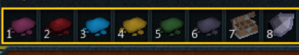

import React from 'react';
import TopBanner from '@site/src/components/TopBanner';
import ContentBlock from '@site/src/components/ContentBlock';
import Changelog from '@site/src/components/Changelog';
import BrowserWindow from '@site/src/components/BrowserWindow';
import changes from './changes.json';

<TopBanner title="Dead Digger" version="2024.03" skill="Archaeology">
</TopBanner>

:::hidden
## Changelog
:::

<Changelog changes={changes}>

</Changelog>

:::hidden
## Requirements
:::

<ContentBlock title="Requirements">

- AutoScreener / Soilbox has to be present in inventory
- Soilbox has to be on the action bar slot
- The soil for the location you're at should be on the action bar slot
    -  It is recommended to have an action setup as show below to cover all digsites
<BrowserWindow url="Recommended Actionbar">

</BrowserWindow>
- Steps mentioned in the Configuration section have to be followed for proper functionality of the following:
    - Depositing materials
    - Banking artifacts
</ContentBlock>

:::hidden
## Configuration
:::

<ContentBlock title="Configuration">

The following three methods have to be configured by you based on the digsite.

- ### Depositing

The following function has to be configured based on the excavation site you're at.

```lua showLineNumbers
-- This function handles depositing
local function depositCart()
    API.logDebug('Inventory is full after using soilbox, trying to deposit: ' .. depositAttempt)
    depositAttempt = depositAttempt + 1;
    local cart = API.GetAllObjArrayInteract_str({ cartName }, 60, 0)
    if #cart > 0 then
        API.DoAction_Object_string1(0x29, API.OFF_ACT_GeneralObject_route0, { cartName },
            60, true);
        UTILS.randomSleep(800)
        API.WaitUntilMovingEnds()
        if not API.InvFull_() then
            depositAttempt = 0
        end
    else
        API.logWarn('Didn\'t find: "' .. cartName .. '" within 60 tiles')
    end
end
```

- ### Banking

This function handles banking when `Bank Artifacts` is selected.

```lua showLineNumbers
local function bank()
    API.logDebug('Going to bank')
end
```

Once you're done banking, you'd have to traverse back to the digsite, which is handled by the below function.

```lua showLineNumbers
local function goBack()
    API.logDebug('Going back to digsite')
end
```

</ContentBlock>

:::hidden
## Code
:::

<ContentBlock title="Code">

```lua showLineNumbers
--[[
# Script Name:   DeadDigger™
# Description:  <Digger Helper>
# Autor:        <Dead (dea.d - Discord)>
# Version:      <3.2>
# Datum:        <2024.02.29>
--]]

local version = "3.2"
print("Run DeadDigger " .. version)
local API = require("api")
local UTILS = require("utils")

API.SetDrawLogs(true)
API.SetDrawTrackedSkills(true)

--#region User Inputs
-- highlight-next-line
local cartName = "Materials cart" -- name of the object to deposit materials

--highlight-start
local soilboxCapacity = 100 -- capacity of the soilbox. Increase can be purchased
--highlight-end
--#endregion

--#region Imgui Setup
local imguiBackground = API.CreateIG_answer()
imguiBackground.box_name = "imguiBackground"
imguiBackground.box_start = FFPOINT.new(16, 20, 0)
imguiBackground.box_size = FFPOINT.new(400, 116, 0)

local getTargetBtn = API.CreateIG_answer()
getTargetBtn.box_name = "Get"
getTargetBtn.box_start = FFPOINT.new(16, 20, 0)
getTargetBtn.box_size = FFPOINT.new(50, 30, 0)
getTargetBtn.tooltip_text = "Populate hotspots list"

local setTargetBtn = API.CreateIG_answer()
setTargetBtn.box_name = "Set"
setTargetBtn.box_start = FFPOINT.new(60, 20, 0)
setTargetBtn.box_size = FFPOINT.new(50, 30, 0)
setTargetBtn.tooltip_text = "The script excavate this spot"

local imguicombo = API.CreateIG_answer()
imguicombo.box_name = "Hotspots     "
imguicombo.box_start = FFPOINT.new(100, 20, 0)
imguicombo.stringsArr = { "a", "b" }
imguicombo.tooltip_text = "Available hotspots to target"

local imguiCurrentTarget = API.CreateIG_answer()
imguiCurrentTarget.box_name = "Current Target:"
imguiCurrentTarget.box_start = FFPOINT.new(30, 50, 0)

local imguiExcavate = API.CreateIG_answer()
imguiExcavate.box_name = "Excavate"
imguiExcavate.box_start = FFPOINT.new(18, 60, 0)
imguiExcavate.box_size = FFPOINT.new(80, 30, 0)
imguiExcavate.tooltip_text = "Start/Stop Excavating"

local imguiTerminate = API.CreateIG_answer()
imguiTerminate.box_name = "Stop Script"
imguiTerminate.box_start = FFPOINT.new(100, 60, 0)
imguiTerminate.box_size = FFPOINT.new(100, 30, 0)
imguiTerminate.tooltip_text = "Exit the script"

local imguiRuntime = API.CreateIG_answer()
imguiRuntime.box_name = "imguiRuntime"
imguiRuntime.box_start = FFPOINT.new(30, 90, 0)

local imguiDestroy = API.CreateIG_answer()
imguiDestroy.box_name = "Destroy Artifacts"
imguiDestroy.tooltip_text = "Destroying: false"
imguiDestroy.box_start = FFPOINT.new(200, 60, 0)

local imguiBank = API.CreateIG_answer()
imguiBank.box_name = "Bank Artifacts"
imguiBank.tooltip_text = "Banking: false"
imguiBank.box_start = FFPOINT.new(200, 80, 0)

--#endregion

--#region Variables init
local targetPlaceholder = "None. Click Set Hotspot"
local startTime, lastXpTime, afk = os.time(), os.time(), os.time()
local skillName = "ARCHAEOLOGY"
local currentXp = 0
local MAX_IDLE_TIME_MINUTES = 5
local depositAttempt = 0
local artifactsFound = 0
local soilBoxFull = false
local shouldBank = false
local shouldDestroy = false
local target = targetPlaceholder
local runLoop = false
local targetNotFoundCount = 0
local targets = {}
local selectedTarget
local COLORS = {
    BACKGROUND = ImColor.new(10, 13, 29),
    TARGET_UNSET = ImColor.new(189, 185, 167),
    TARGET_SET = ImColor.new(70, 143, 126),
    EXCAVATE = ImColor.new(84, 166, 102),
    PAUSED = ImColor.new(238, 59, 83),
    RUNTIME = ImColor.new(198, 120, 102)
}

imguiBackground.colour = COLORS.BACKGROUND
imguiCurrentTarget.colour = COLORS.TARGET_UNSET
imguiRuntime.colour = COLORS.EXCAVATE
--#endregion

--#region Util functions

local function idleCheck()
    local timeDiff = os.difftime(os.time(), afk)
    local randomTime = math.random((MAX_IDLE_TIME_MINUTES * 60) * 0.6, (MAX_IDLE_TIME_MINUTES * 60) * 0.9)

    if timeDiff > randomTime then
        API.PIdle2()
        afk = os.time()
    end
end

local function formatElapsedTime(start)
    local currentTime = os.time()
    local elapsedTime = currentTime - start
    local hours = math.floor(elapsedTime / 3600)
    local minutes = math.floor((elapsedTime % 3600) / 60)
    local seconds = elapsedTime % 60
    return string.format("Runtime: %02d:%02d:%02d", hours, minutes, seconds)
end

local function gameStateChecks()
    local gameState = API.GetGameState2()
    if (gameState ~= 3) then
        API.logError('Not ingame with state: ' .. tostring(gameState))
        print('Not ingame with state: ' .. tostring(gameState))
        API.Write_LoopyLoop(false)
        return
    end
    if targetNotFoundCount > 30 then
        imguiExcavate.box_name = "Excavate"
        runLoop = false
        API.Write_LoopyLoop(false)
    end
end

local function terminate()
    runLoop = false
    API.Write_LoopyLoop(false)
end

--#endregion


local DIGSITES = {
    EVERLIGHT = {
        SOIL = { ID = 49519, VB = 9371, NAME = "Saltwater mud" },
        PRODROMOI = {
            LABEL = "Prodromoi remains",
            ID = { 116661 },
            LEVEL = 42
        },
        MONOCEROS = {
            LABEL = "Monoceros remains",
            ID = { 116663 },
            LEVEL = 48
        },
        AMPHITHEATER = {
            LABEL = "Amphitheatre debris",
            ID = { 116665 },
            LEVEL = 51
        },
        CERAMICS = {
            LABEL = "Ceramics studio debris",
            ID = { 116666, 116667 },
            LEVEL = 56
        },
        STADIO = {
            LABEL = "Stadio debris",
            ID = { 116669 },
            LEVEL = 61
        },
        DOMINION = {
            LABEL = "Dominion Games podium",
            ID = { 116671 },
            LEVEL = 69
        },
        OIKOS_STUDIO = {
            LABEL = "Oikos studio debris",
            ID = { 116673 },
            LEVEL = 72
        },
        OIKOS_HUT = {
            LABEL = "Oikos fishing hut remnants",
            ID = { 116675 },
            LEVEL = 84
        },
        ACROPOLIS = {
            LABEL = "Acropolis debris",
            ID = { 116677 },
            LEVEL = 92
        },
        ICYENE = {
            LABEL = "Icyene weapon rack",
            ID = { 116679 },
            LEVEL = 100
        },
        STOCKPILED_ART = {
            LABEL = "Stockpiled art",
            ID = { 116683 },
            LEVEL = 105
        },
        BIBLIOTHEKE = {
            LABEL = "Bibliotheke debris",
            ID = { 116680, 116681 },
            LEVEL = 109
        },
        OPTIMATOI = {
            LABEL = "Optimatoi remains",
            ID = { 116685 },
            LEVEL = 117
        }
    },
    INFERNAL = {
        SOIL = { ID = 49521, VB = 9372, NAME = "Fiery brimstone" },
        LODGE_BAR = {
            LABEL = "Lodge bar storage",
            ID = { 116817 },
            LEVEL = 20
        },
        LODGE_ART = {
            LABEL = "Lodge art storage",
            ID = { 116819 },
            LEVEL = 24
        },
        CULTIST = {
            LABEL = "Cultist footlocker",
            ID = { 116821 },
            LEVEL = 29
        },
        SACRIFICIAL = {
            LABEL = "Sacrificial altar",
            ID = { 116823 },
            LEVEL = 36
        },
        DIS_DUNGEON = {
            LABEL = "Dis dungeon debris",
            ID = { 116825 },
            LEVEL = 45
        },
        INFERNAL = {
            LABEL = "Infernal art",
            ID = { 116827 },
            LEVEL = 65
        },
        SHAKROTH = {
            LABEL = "Shakroth remains",
            ID = { 116829 },
            LEVEL = 68
        },
        ANIMAL_TROPHIES = {
            LABEL = "Animal trophies",
            ID = { 116831 },
            LEVEL = 81
        },
        DIS_OVERSPILL = {
            LABEL = "Dis overspill",
            ID = { 116833 },
            LEVEL = 89
        },
        BYZROTH = {
            LABEL = "Byzroth remains",
            ID = { 116835 },
            LEVEL = 98
        },
        HELLFIRE_FORGE = {
            LABEL = "Hellfire forge",
            ID = { 116839 },
            LEVEL = 104
        },
        CHTHONIAN = {
            LABEL = "Chthonian trophies",
            ID = { 116837 },
            LEVEL = 110
        },
        TSUTSAROTH = {
            LABEL = "Tsutsaroth remains",
            ID = { 116841 },
            LEVEL = 116
        }
    },
    KHARID = {
        SOIL = { ID = 49517, VB = 9370, NAME = "Ancient gravel" },
        VENATOR = {
            LABEL = "Venator remains",
            ID = { 117101 },
            LEVEL = 5
        },
        LEGIONARY = {
            LABEL = "Legionary remains",
            ID = { 117103 },
            LEVEL = 12
        },
        FORT = {
            LABEL = "Fort debris",
            ID = { 116921, 116922, 116923, 116924 },
            LEVEL = 12
        },
        CASTRA = {
            LABEL = "Castra debris",
            ID = { 117106 },
            LEVEL = 12
        },
        ADMINISTRATUM = {
            LABEL = "Administratum debris",
            ID = { 117108 },
            LEVEL = 25
        },
        PRAESIDIO = {
            LABEL = "Praesidio remains",
            ID = { 117110 },
            LEVEL = 47
        },
        CARCERUM = {
            LABEL = "Carcerem debris",
            ID = { 117112 },
            LEVEL = 58
        },
        CHAPEL = {
            LABEL = "Kharid-et chapel debris",
            ID = { 117114 },
            LEVEL = 74
        },
        PONTIFEX = {
            LABEL = "Pontifex remains",
            ID = { 117116 },
            LEVEL = 81
        },
        ORCUS_ALTAR = {
            LABEL = "Orcus altar",
            ID = { 117118 },
            LEVEL = 86
        },
        ARMARIUM = {
            LABEL = "Armarium debris",
            ID = { 117120 },
            LEVEL = 93
        },
        CULINARUM = {
            LABEL = "Culinarum debris",
            ID = { 117122, 119386 },
            LEVEL = 100
        },
        ANCIENT = {
            LABEL = "Ancient magick munitions",
            ID = { 117124 },
            LEVEL = 107
        },
        PRAETORIAN = {
            LABEL = "Praetorian remains",
            ID = { 117126 },
            LEVEL = 114
        },
        WAR = {
            LABEL = "War table debris",
            ID = { 117128 },
            LEVEL = 118
        }
    },
    ORTHEN = {
        SOIL = { ID = 50696, VB = 9578, NAME = "Volcanic ash" },
        VARANUSAUR = {
            LABEL = "Varanusaur remains",
            ID = { 119075 },
            LEVEL = 90
        },
        RELIQUARY = {
            LABEL = "Dragonkin reliquary",
            ID = { 119077 },
            LEVEL = 96
        },
        COFFIN = {
            LABEL = "Dragonkin coffin",
            ID = { 119079 },
            LEVEL = 99
        },
        AUTOPSY = {
            LABEL = "Autopsy table",
            ID = { 119081 },
            LEVEL = 101
        },
        EXPERIMENT = {
            LABEL = "Experiment workbench",
            ID = { 119083 },
            LEVEL = 102
        },
        AUGHRA = {
            LABEL = "Aughra remains",
            ID = { 119085 },
            LEVEL = 106
        },
        MOKSHA = {
            LABEL = "Moksha device",
            ID = { 119087 },
            LEVEL = 108
        },
        MINE = {
            LABEL = "Xolo mine",
            ID = { 119089 },
            LEVEL = 113
        },
        REMAINS = {
            LABEL = "Xolo remains",
            ID = { 119091 },
            LEVEL = 119
        },
        SAURTHEN = {
            LABEL = "Saurthen debris",
            ID = { 119093 },
            LEVEL = 120
        }
    },
    SENNTISTEN = {
        SOIL = { ID = 49517, VB = 9370, "Ancient gravel" },
        MINISTRY = {
            LABEL = "Ministry remains",
            ID = { 121157 },
            LEVEL = 60
        },
        CATHEDRAL = {
            LABEL = "Cathedral debris",
            ID = { 121155 },
            LEVEL = 62
        },
        MARKETPLACE = {
            LABEL = "Marketplace debris",
            ID = { 121159 },
            LEVEL = 63
        },
        INQUISITOR = {
            LABEL = "Inquisitor remains",
            ID = { 121161 },
            LEVEL = 64
        },
        GLADIATOR = {
            LABEL = "Gladiator remains",
            ID = { 121165 },
            LEVEL = 66
        },
        CITIZEN = {
            LABEL = "Citizen remains",
            ID = { 121163 },
            LEVEL = 67
        }
    },
    STORMGUARD = {
        SOIL = { ID = 49523, VB = 9373, NAME = "Aerated sediment" },
        IKOVIAN = {
            LABEL = "Ikovian memorial",
            ID = { 117202 },
            LEVEL = 70
        },
        KESHIK = {
            LABEL = "Keshik ger",
            ID = { 117204 },
            LEVEL = 76
        },
        TAILORY = {
            LABEL = "Tailory debris",
            ID = { 117206 },
            LEVEL = 81
        },
        WEAPONS = {
            LABEL = "Weapons research debris",
            ID = { 117208 },
            LEVEL = 85
        },
        GRAVITRON = {
            LABEL = "Gravitron research debris",
            ID = { 117210 },
            LEVEL = 91
        },
        TOWER = {
            LABEL = "Keshik tower debris",
            ID = { 117214 },
            LEVEL = 95
        },
        GOLEM = {
            LABEL = "Destroyed golem",
            ID = { 117216 },
            LEVEL = 98
        },
        RACK = {
            LABEL = "Keshik weapon rack",
            ID = { 117218 },
            LEVEL = 103
        },
        FLIGHT = {
            LABEL = "Flight research debris",
            ID = { 117212 },
            LEVEL = 111
        },
        AETHERIUM = {
            LABEL = "Aetherium forge",
            ID = { 117220 },
            LEVEL = 112
        },
        HOWL = {
            LABEL = "Howls workshop debris",
            ID = { 117222 },
            LEVEL = 118
        }
    },
    WARFORGE = {
        SOIL = { ID = 49525, VB = 9374, NAME = "Earthen clay" },
        GLADIATORIAL = {
            LABEL = "Gladiatorial goblin remains",
            ID = { 117365 },
            LEVEL = 76
        },
        CRUCIBLE = {
            LABEL = "Crucible stands debris",
            ID = { 117367 },
            LEVEL = 81
        },
        DORM = {
            LABEL = "Goblin dorm debris",
            ID = { 117371 },
            LEVEL = 83
        },
        BARRICADE = {
            LABEL = "Barricade",
            ID = { 117246, 117247 },
            LEVEL = 83
        },
        WAR_GOD = {
            LABEL = "Big High War God shrine",
            ID = { 117377 },
            LEVEL = 89
        },
        YUBIUSK = {
            LABEL = "Yubiusk animal pen",
            ID = { 117373 },
            LEVEL = 94
        },
        GOBLIN = {
            LABEL = "Goblin trainee remains",
            ID = { 117379 },
            LEVEL = 97
        },
        KYJAZ = {
            LABEL = "Kyzaj champions boudoir",
            ID = { 117375 },
            LEVEL = 100
        },
        SCRAP = {
            LABEL = "Warforge scrap pile",
            ID = { 117381 },
            LEVEL = 104
        },
        RACK = {
            LABEL = "Warforge weapon rack",
            ID = { 117383 },
            LEVEL = 110
        },
        BANDOS = {
            LABEL = "Bandos sanctum debris",
            ID = { 117369 },
            LEVEL = 115
        },
        PIE = {
            LABEL = "Makeshift pie oven",
            ID = { 117385 },
            LEVEL = 119
        }
    }
}

local IDS = {
    SOILBOX = 49538,
    AUTOSCREENER = 50161,
    ELVEN_SHARD = 43358
}

local function filterDigsitesByLevel(digsites, level)
    local filteredDigsites = {}

    for zone, locations in pairs(digsites) do
        filteredDigsites[zone] = {}
        for location, data in pairs(locations) do
            if type(data) == "table" and data.LEVEL and data.LEVEL <= level then
                table.insert(filteredDigsites[zone], { [location] = data })
            end
        end

        table.sort(filteredDigsites[zone], function(a, b)
            return a[next(a)].LEVEL > b[next(b)].LEVEL
        end)
    end
    return filteredDigsites
end

-- Function to filter DIGSITES by IDs
local function filterDigsitesByIds(digsites, idsToFilter)
    local filteredDigsites = {}
    for zone, locations in pairs(digsites) do
        filteredDigsites[zone] = {}
        for location, data in pairs(locations) do
            if type(data) == "table" and data.VB then
                -- ignore soil table
            elseif type(data) == "table" and data.ID then
                local filteredIdTable = {}
                for _, id in ipairs(data.ID) do
                    if UTILS.tableIncludes(idsToFilter, id) then
                        table.insert(filteredIdTable, id)
                    end
                end
                if #filteredIdTable > 0 then
                    local filteredData = { LABEL = data.LABEL, ID = filteredIdTable, LEVEL = data.LEVEL }
                    table.insert(filteredDigsites[zone], { [location] = filteredData })
                end
            end
        end
        table.sort(filteredDigsites[zone], function(a, b)
            return a[next(a)].LEVEL > b[next(b)].LEVEL
        end)
    end

    return filteredDigsites
end

local function getFilteredItemIds(filteredDigsites)
    local ids = {}

    for _, locations in pairs(filteredDigsites) do
        for _, locationData in ipairs(locations) do
            for _, data in pairs(locationData) do
                for _, id in ipairs(data.ID) do
                    table.insert(ids, id)
                end
            end
        end
    end

    return ids
end

local function populateDropdown()
    local filteredHotspots = filterDigsitesByLevel(DIGSITES, API.GetSkillByName("ARCHAEOLOGY").level)
    -- Get the IDs of the filtered and sorted items
    local items = {}
    local filteredItemIds = getFilteredItemIds(filteredHotspots)
    local found = API.GetAllObjArrayInteract(filteredItemIds, 70, {0})

    local distinct = UTILS.getDistinctByProperty(found, "Id")
    for i = 1, #distinct, 1 do
        local item = distinct[i]
        table.insert(items, (item.Id))
    end

    local foundThingsByLevel = filterDigsitesByIds(DIGSITES, items)

    for zone, locations in pairs(foundThingsByLevel) do
        for _, locationData in ipairs(locations) do
            for location, data in pairs(locationData) do
                table.insert(targets,
                    { SOIL = DIGSITES[zone].SOIL, LABEL = "Lvl:" .. data.LEVEL .. " - " .. data.LABEL, IDS = data.ID })
            end
        end
    end

    if #targets > 0 then
        local valueStrings = {}
        for i = 1, #targets, 1 do
            local item = targets[i]
            table.insert(valueStrings, item.LABEL)
        end
        imguicombo.stringsArr = valueStrings
        imguicombo.int_value = 0
    else
        API.logWarn("No hotspots found in range")
    end
    -- return dropdownValues
end

local function preFlightChecks()
    API.logWarn("selected " .. selectedTarget.SOIL.NAME)
    local soilBar = API.GetABs_name1(selectedTarget.SOIL.NAME)
    local soilBox = API.GetABs_name1("Archaeological soil box")
    local autoscreener = API.InvItemFound1(IDS.AUTOSCREENER)

    if soilBar == nil then
        API.logError("Couldn't find " .. selectedTarget.SOIL.NAME .. " on the action bar")
        return false
    end
    if (not autoscreener and soilBox == nil) then
        API.logError("Couldn't find autoscreener in inventory\nand soilbox on the action bar")
        return false
    end
    return true
end

local function setHotspot()
    API.logDebug("setHotspot")
    local currentHotspot = target
    local selected = imguicombo.stringsArr[imguicombo.int_value + 1]
    selectedTarget = targets[imguicombo.int_value + 1]
    if currentHotspot ~= selected then
        target = selected
    end
    if not preFlightChecks() then
        API.logError("preflight checks failed")
        return
    end
    imguiCurrentTarget.colour = COLORS.TARGET_SET
    setTargetBtn.return_click = false
end

local function pauseExcavation()
    runLoop = false
    API.logDebug("Excavation paused")
    imguiExcavate.return_click = false
    imguiCurrentTarget.colour = COLORS.PAUSED
    imguiRuntime.colour = COLORS.PAUSED
    imguiExcavate.box_name = "Excavate"
end

local function hasElvenRitualShard()
    return API.InvItemcount_1(IDS.ELVEN_SHARD) > 0
end

local function useElvenRitualShard()
    if not (API.InvItemcount_1(IDS.ELVEN_SHARD) > 0) then return end
    local prayer = API.GetPrayPrecent()
    local elvenCD = API.DeBuffbar_GetIDstatus(IDS.ELVEN_SHARD, false)
    if prayer < 50 and not elvenCD.found then
        API.logDebug("Using Elven Shard")
        API.DoAction_Inventory1(IDS.ELVEN_SHARD, 43358, 1, API.OFF_ACT_GeneralInterface_route)
        UTILS.randomSleep(600)
    end
end

local function startExcavation()
    API.logDebug("Excavation started")
    runLoop = true
    imguiCurrentTarget.colour = COLORS.EXCAVATE
    imguiRuntime.colour = COLORS.EXCAVATE
    imguiExcavate.box_name = "Pause"
end

local artifactFoundInterface = {
    InterfaceComp5.new(1189, 2, -1, -1, 0),
}

local destroyInterface = {
    InterfaceComp5.new(1183, 11, -1, -1, 0),
}

local function destroyInterfaceFound()
    local result = API.ScanForInterfaceTest2Get(true, destroyInterface)
    if #result > 0 then
        return true
    else
        return false
    end
end

local function artifactFoundInterfacePresent()
    local result = API.ScanForInterfaceTest2Get(true, artifactFoundInterface)
    if #result > 0 then
        return true
    else
        return false
    end
end

local function FindHl(objects, maxdistance, highlight)
    local objObjs = API.GetAllObjArray1(objects, maxdistance, {0})
    local hlObjs = API.GetAllObjArray1(highlight, maxdistance, {4})
    local shiny = {}
    for i = 0, 1.5, 0.1 do
        for _, obj in ipairs(objObjs) do
            for _, hl in ipairs(hlObjs) do
                if math.abs(obj.Tile_XYZ.x - hl.Tile_XYZ.x) < i and math.abs(obj.Tile_XYZ.y - hl.Tile_XYZ.y) < i then
                    shiny = obj
                end
            end
        end
    end
    return shiny
end

local function depositCart()
    API.logDebug("Inventory is full after using soilbox, trying to deposit: " .. depositAttempt)
    depositAttempt = depositAttempt + 1;
    local cart = API.GetAllObjArrayInteract_str({ cartName }, 60, { 0 })
    if #cart > 0 then
        API.DoAction_Object_string1(0x29, API.OFF_ACT_GeneralObject_route0, { cartName }, 60, true);
        UTILS.randomSleep(800)
        API.WaitUntilMovingEnds()
        if not API.InvFull_() then
            depositAttempt = 0
        end
    else
        API.logWarn("Didn't find: " .. cartName .. " within 60 tiles")
    end
end

local function destroyArtifacts()
    local inventory = API.ReadInvArrays33()

    local items = UTILS.getDistinctByProperty(inventory, "textitem")
    for i = 1, #items, 1 do
        local item = items[i]
        if string.find(tostring(item.textitem), "damaged") then
            local count = API.InvItemcount_1(item.itemid1)
            API.logWarn("Destroying " .. item.textitem)
            API.DoAction_Interface(0x24, item.itemid1, 8, item.id1, item.id2, item.id3,
                API.OFF_ACT_GeneralInterface_route2)
            UTILS.SleepUntil(destroyInterfaceFound, 5, "Destroying " .. item.textitem)
            if count > 1 then
                API.DoAction_Interface(0xffffffff, 0xffffffff, 0, 1183, 7, -1, API
                .OFF_ACT_GeneralInterface_Choose_option)
            else
                API.DoAction_Interface(0xffffffff, 0xffffffff, 0, 1183, 5, -1, API
                .OFF_ACT_GeneralInterface_Choose_option)
            end
            UTILS.randomSleep(800)
        end
    end
end

local function dropSoil()
    local soilCount = API.InvItemcount_1(selectedTarget.SOIL.ID)
    local soilbar = API.GetABs_name1(selectedTarget.SOIL.NAME)
    if soilbar ~= nil and soilCount > 0 then
        API.logDebug("Dropping " .. soilCount .. " " .. selectedTarget.SOIL.NAME)
        for i = 1, soilCount, 1 do
            API.DoAction_Ability(selectedTarget.SOIL.NAME, 8, API.OFF_ACT_GeneralInterface_route2)
            UTILS.rangeSleep(50, 10, 100)
        end
    end
    UTILS.randomSleep(800)
end

local function bank()
    math.randomseed(os.time())
    API.logDebug("Going to bank")
    depositAttempt = depositAttempt + 1
    API.DoAction_Object_string1(0x5, 80, { "Bank chest" }, 50, false)
    UTILS.randomSleep(600 * 2)
    API.WaitUntilMovingEnds()
    if API.BankOpen2() then
        API.KeyboardPress2(0x31, 100, 200)
        depositAttempt = 0
    end
end

local function goBack()
    API.logDebug('Going back to digsite')
end

local function fillSoilbox()
    if API.InvItemFound1(IDS.AUTOSCREENER) then
        return
    end
    if API.InvItemFound1(IDS.SOILBOX) and not soilBoxFull then
        if API.VB_FindPSett(selectedTarget.SOIL.VB).SumOfstate >= soilboxCapacity then
            soilBoxFull = true
        else
            soilBoxFull = false
            local soilCount = API.InvItemcount_1(selectedTarget.SOIL.ID)
            if soilCount > 0 then
                API.DoAction_Ability("Archaeological soil box", 1, API.OFF_ACT_GeneralInterface_route)
                UTILS.countTicks(2)
            end
        end
    end
end

local function inventoryCheck()
    if depositAttempt > 5 then
        API.logError("Inventory still full after depositing 5 times")
        pauseExcavation()
        terminate()
        return false
    end
    if os.difftime(os.time(), lastXpTime) > 300 then
        API.logError("Havent gained XP for a long time, exiting")
        pauseExcavation()
        terminate()
        return false
    end
    if API.InvFull_() then
        local emptySpots = API.Invfreecount_()
        fillSoilbox()
        dropSoil()
        if shouldDestroy then
            destroyArtifacts()
        end
        local spotsAfterFill = API.Invfreecount_()
        if spotsAfterFill <= emptySpots then
            depositCart()

            if shouldBank then
                bank()
                goBack()
            end
        end
    end
end

local function followTimeSprite(objects)
    local foundObjects = API.GetAllObjArray1(objects.IDS, 60, {0})
    local targetIds = {}
    for i = 1, #foundObjects do
        local rock = foundObjects[i]
        table.insert(targetIds, rock.Id)
    end
    local sprite = FindHl(targetIds, 60, { 7307 })
    if not API.ReadPlayerMovin2() then
        if sprite.Id ~= nil then
            local spritePos = WPOINT.new(sprite.TileX / 512, sprite.TileY / 512, sprite.TileZ / 512)
            local distanceF = API.Math_DistanceF(API.PlayerCoordfloat(), sprite.Tile_XYZ)
            if distanceF > 1.6 then
                UTILS.randomSleep(400)
                if not API.CheckAnim(20) and #foundObjects > 0 then
                    API.logInfo("Excavating " .. target)
                else
                    API.logInfo("Sprite has moved, chasing it")
                end
                API.DoAction_Object2(0x2, API.OFF_ACT_GeneralObject_route0, { sprite.Id }, 60, spritePos)
                UTILS.randomSleep(1000)
                API.WaitUntilMovingEnds()
                return
            end
        end
        if artifactFoundInterfacePresent() then
            artifactsFound = artifactsFound + 1
            API.logInfo("Found artifact, excavating again " .. target)
            API.DoAction_Object1(0x2, API.OFF_ACT_GeneralObject_route0, targetIds, 60)
            UTILS.randomSleep(800)
            return
        end
        if not API.CheckAnim(40) and not API.InvFull_() and #foundObjects > 0 then
            API.logInfo("Excavating " .. target)
            API.DoAction_Object1(0x2, API.OFF_ACT_GeneralObject_route0, targetIds, 60)
            UTILS.randomSleep(800)
        end
    end
end

local function drawGUI()
    if imguiTerminate.return_click then
        terminate()
    end
    if imguiExcavate.return_click then
        if not runLoop then
            startExcavation()
        end
    else
        if runLoop then
            pauseExcavation()
        end
    end
    if getTargetBtn.return_click then
        populateDropdown()
        getTargetBtn.return_click = false
    end
    if not runLoop and setTargetBtn.return_click then
        setHotspot()
    end
    local destroyStatus = imguiDestroy.box_ticked
    local bankStatus = imguiBank.box_ticked

    if destroyStatus ~= shouldDestroy then
        shouldDestroy = destroyStatus
        API.logWarn("Destroying artifacts? : " .. tostring(shouldDestroy))
        imguiDestroy.tooltip_text = "Destroying: " .. tostring(shouldDestroy)
    end

    if bankStatus ~= shouldBank then
        shouldBank = bankStatus
        API.logWarn("Banking artifacts? : " .. tostring(shouldBank))
        imguiBank.tooltip_text = "Banking: " .. tostring(shouldBank)
    end

    API.DrawSquareFilled(imguiBackground)
    API.DrawBox(setTargetBtn)
    API.DrawBox(getTargetBtn)
    API.DrawCheckbox(imguiDestroy)
    API.DrawCheckbox(imguiBank)
    if (#targets > 0) then
        API.DrawComboBox(imguicombo, false)
    end
    imguiCurrentTarget.string_value = "Current hotspot:" .. target
    if runLoop then
        imguiRuntime.string_value = formatElapsedTime(startTime)
    end
    API.DrawBox(imguiExcavate)
    API.DrawBox(imguiTerminate)
    API.DrawTextAt(imguiCurrentTarget)
    API.DrawTextAt(imguiRuntime)
end

--#endregion

--#region Main loop
API.logWarn("Started DeadDigger " .. version)
API.Write_LoopyLoop(true)
populateDropdown()
while (API.Read_LoopyLoop()) do ------------------------------------------------------
    API.DoRandomEvents()
    gameStateChecks()
    idleCheck()
    drawGUI()
    if runLoop and selectedTarget ~= nil then
        inventoryCheck()
        if hasElvenRitualShard() then
            useElvenRitualShard()
        end
        followTimeSprite(selectedTarget)
    end
    UTILS.randomSleep(300)
    local xp = API.GetSkillXP(skillName)
    if (xp ~= currentXp) then
        currentXp = xp
        lastXpTime = os.time()
    end
end ----------------------------------------------------------------------------------
API.logWarn("Stopped DeadDigger " .. version)
API.logWarn("Runtime " .. API.ScriptRuntimeString())
--#endregion
```
</ContentBlock>


:::hidden
## Credits
:::

<ContentBlock title="Credits">
- #### HigginsHax
  - Contribution - ProgressBar to track XP and runtime
- #### Grunstadt
  - Contribution - Soilbox varbits
</ContentBlock>